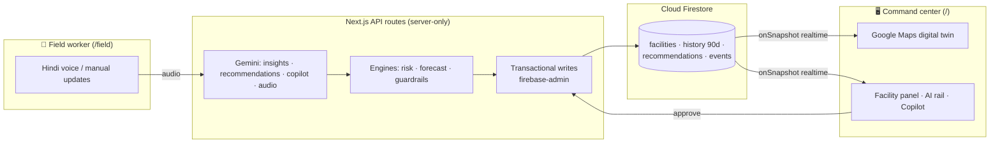

# HealthGrid AI

**An AI command center for district public healthcare.** HMIS systems record what happened; HealthGrid decides what to do next — and a health worker speaking Hindi into a phone changes the district map in front of the District Health Officer's eyes.

Built for the Google **Build with AI — Code for Communities** hackathon · Smart Health track.


## The problem

India's ~25,000 PHCs and ~5,000 CHCs run on paper registers and monthly reports. Medicine stock-outs, doctor absences, and bed shortages are discovered **after** patients are turned away. The data that could prevent this — daily stock levels, attendance, footfall — is trapped at the facility and reaches the district weeks late, if at all.

## What HealthGrid does

One continuous loop: **Observe → Understand → Predict → Recommend → Approve → Execute → Monitor.**

| Capability | How it works |
|---|---|
| 🗺️ **Live district map** | Every facility scored 0–100 by a deterministic risk engine (medicines 40 · staffing 25 · beds 15 · surge 10 · diagnostics 10), rendered on dark-styled Google Maps with realtime Firestore listeners — no refresh, ever. |
| 📉 **Stock-out forecasting** | Weighted burn-rate model (7-day/30-day consumption, patient-trend amplified) computes days-to-stock-out per medicine per facility. |
| 🔎 **AI root-cause analysis** | Gemini explains *why* a facility is at risk, grounded strictly in the live snapshot — every claim cites a number from the data. |
| 🔁 **Guarded transfer recommendations** | Gemini proposes stock transfers from pre-filtered surplus donors; the server **clamps every quantity** (≤40% of donor stock, donor keeps >14 days supply) before anything is shown. One click executes the transfer as a Firestore transaction and both facilities re-score live. |
| 💬 **Health Copilot** | Gemini function-calling over four live-data tools (`getDistrictSummary`, `getFacility`, `getForecasts`, `listFacilities`). Ask in English or Hindi. It can never disagree with the screen, because it reads the same engines. |
| 🎙️ **Hindi voice updates** | A frontline worker holds a button and says *"आज ओआरएस का स्टॉक 50 बचा है"*. Gemini's audio understanding returns a structured update, the worker confirms on screen, the district re-scores, and the map reacts in seconds. |


## Measured impact

We replayed the district's 90 days of history and projected the next 30 days with and without HealthGrid's transfer policy (same deterministic engines, reproducible via `npx tsx scripts/impact-sim.ts`):

> **54 facility-medicine stock-out days across 5 facilities in the next 30 days — reduced to 0** by 31 guarded transfers redistributing 5,157 units of existing district stock. **Zero new medicine purchased.**

The simulation assumes replenishment continues on each facility's observed cadence; HealthGrid's only intervention is the same guarded transfer recommendation shown in the UI. In other words: the medicines to prevent every projected stock-out already exist inside the district — what's missing is the visibility and coordination layer.

## Fits the existing stack — a decision layer, not a replacement

India's public health system already records this data: **HMIS** captures facility reporting, and **DVDMS/eVIN** track drug inventory and logistics. What those systems don't do is *decide* — data flows up as monthly aggregates, and interventions flow back down weeks later. HealthGrid is designed as the **decision layer on top of that existing pipeline**:

- **Ingest:** facility state can be hydrated from HMIS/DVDMS exports (the Firestore schema mirrors their entities: facility → inventory → consumption); the voice/field interface fills the real-time gap between monthly reports rather than replacing them.
- **Act:** recommendations and approvals generate an audit trail (`events` collection) that maps directly onto the existing indent/transfer paperwork.
- **No rip-and-replace:** district administrators keep their systems of record; HealthGrid turns those records into same-day decisions.

## Why the AI is defensible

Every number on screen comes from **deterministic engines we wrote and unit-tested** (45 tests) — risk scoring, burn-rate forecasting, transfer guardrails. Gemini does what LLMs are actually good at: explanation, structured proposals, tool-calling, and multilingual audio understanding. AI proposals are validated and clamped server-side before display; nothing writes to the database without human confirmation.

## Architecture



**Google technologies:** Gemini API (structured outputs, function calling, audio understanding, multilingual), Cloud Firestore (realtime sync), Google Maps Platform (district digital twin), Firebase (hosting & admin SDK), Next.js on Firebase App Hosting.

## Data methodology

Operational data (daily stock, attendance, footfall) does not exist publicly for Indian PHCs — that gap **is the problem HealthGrid solves**. The demo district is **synthetic but realistic**: real Wardha (Maharashtra) geography and facility types, 90 days of generated history with seasonality and noise, parameters calibrated to public figures from National Health Mission / Rural Health Statistics reporting (facility staffing norms, OPD footfall ranges, stock-out prevalence). The generator is deterministic and unit-tested (`lib/data/generate.ts`); all synthetic data is labeled as such.

## Getting started

```bash
npm install
cp .env.example .env.local   # fill in keys (Gemini, Firebase web config, Maps, service account)
npm run check-keys           # verifies all three credentials
npm run seed                 # seeds the Wardha district into Firestore
npm run dev                  # http://localhost:3000 (DHO) · /field (worker)
```

| Script | Purpose |
|---|---|
| `npm run seed -- --demo-date 2026-07-05` | Reseed with stock-outs timed relative to a date |
| `npm run check-keys` | Verify Gemini + Firestore + Maps credentials |
| `npm test` | 45 engine tests (risk, forecast, guardrails, generator) |
| `npx tsx --env-file=.env.local scripts/deploy-rules.ts` | Publish Firestore security rules |

## Team

Built by **Nishant Rajpathak** & **Saatvik** with Claude Code.
